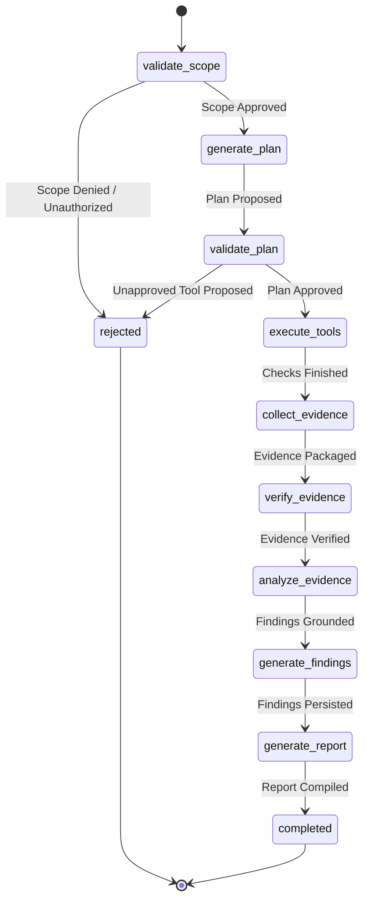

# REDFOX AI

> **Agentic Security Assessment Platform**  
> An educational, independent portfolio prototype demonstrating safe AI agent orchestration, multi-layer policy enforcement, deterministic security testing, grounded RAG guidance, and agent reliability evaluation.

---

## 1. Overview

**REDFOX AI** is a full-stack cybersecurity assessment platform built to demonstrate how autonomous AI agents can be safely architected for security engineering workflows. 

Rather than granting an LLM unrestricted execution permissions or allowing arbitrary web scanning, REDFOX AI establishes strict, fail-closed boundaries:
- The platform **only** executes against a pre-authorized local training target (e.g. OWASP Juice Shop) inside an isolated Docker network.
- The LLM participates in **structured planning**, **evidence explanation**, and **remediation drafting**, but has **zero control** over authorization, target selection, security policy, or arbitrary command execution.
- Security checks are executed by deterministic, bounded Python tools that collect structured evidence.
- The UI provides a modern, dark cybersecurity SaaS dashboard featuring live Server-Sent Events (SSE), visual 9-stage agent workflow progression, filterable findings, raw JSON evidence inspection, and an evaluation dashboard.

---

## 2. Architecture

```mermaid
flowchart TD
    User["Security Engineer"] -->|Browser UI :5173| Frontend["React 19 + TypeScript SPA"]
    Frontend -->|REST APIs + SSE Stream| Backend["FastAPI Backend :8000"]

    subgraph REDFOX AI Core Engine
        Backend --> Policy["Policy Engine (Scope & Tool Policy)"]
        Backend --> DB[("SQLite Database")]

        Policy --> Agent["LangGraph Orchestrator"]
        Agent -->|Structured Planning| LLM["Local LLM (Ollama qwen2.5:3b)"]
        Agent -->|Authoritative Context| RAG["Curated Knowledge Base (OWASP)"]

        Agent --> Registry["Immutable Tool Registry"]
        Registry --> Tools["Deterministic Tools\n(HTTP Status, Headers, Cookies)"]
    end

    subgraph Isolated Security Lab Network
        Tools -.->|Hardened HTTP (No Redirects, Size Limits)| JuiceShop["Target: OWASP Juice Shop :3000\n(Internal Network Only)"]
    end
```

---

## 3. Tech Stack

- **Frontend:** React 19, TypeScript, Vite, Tailwind CSS v4, Lucide React, Recharts.
- **Backend:** FastAPI, Python 3.12, SQLAlchemy 2.0, Pydantic v2, HTTPX.
- **Agent Orchestration:** LangGraph (StateGraph state machine with explicit conditional gates).
- **AI Reasoning:** Local Ollama (`qwen2.5:3b`) with structured Pydantic schema validation and zero-crash deterministic fallback.
- **RAG:** Curated in-memory security guidance retrieval from OWASP projects.
- **Streaming:** Server-Sent Events (SSE) over HTTP for real-time agent activity feeds.
- **Database:** SQLite with relational schema (Assessments, Events, ToolExecutions, Evidence, Findings, Evaluations).
- **Containerization:** Docker & Docker Compose with isolated internal bridge networks.

---

## 4. How the Agent Works

The assessment follows a compiled 9-node LangGraph pipeline:



1. **`validate_scope`:** Verifies target matches configured lab (`http://juice-shop:3000`) and user confirmed authorization.
2. **`generate_plan`:** Requests structured JSON check proposal from local LLM (or fallback baseline).
3. **`validate_plan`:** Verifies every proposed check against the immutable `ToolRegistry`. Fails closed if any tool is unknown.
4. **`execute_tools`:** Dispatches deterministic checks using a hardened HTTP client (timeouts, size caps, redirects disabled).
5. **`collect_evidence`:** Stores raw response attributes as structured JSON objects in SQLite.
6. **`verify_evidence`:** Validates schema bounds and checks evidence integrity.
7. **`analyze_evidence`:** Retrieves relevant OWASP guidance (RAG) and enriches explanations without hallucination.
8. **`generate_findings`:** Deterministically derives findings into severity tiers (Informational, Low, Medium, High).
9. **`generate_report`:** Aggregates findings, timeline, and remediation matrix into an executive report with an educational disclaimer.

---

## 5. Security Model & Guardrails

- **Strict Target Isolation:** Only `http://juice-shop:3000` is permitted. Arbitrary public domains, local network sweeps, and cloud metadata addresses (`169.254.169.254`) are blocked.
- **Fail-Closed Policy Engine:** Missing authorization or ambiguous parameters abort immediately.
- **Immutable Tool Registry:** The LLM cannot execute shell commands, inject CLI arguments, or register new tools dynamically.
- **Hardened HTTP Client:** Follow-redirects is disabled (`follow_redirects=False`) to prevent open-redirect SSRF bypasses; response sizes are capped at 512KB.
- **Prompt-Injection Defense:** External response headers and page contents are treated strictly as untrusted data, preventing adversarial instructions from modifying policy or tool execution.
- **Zero Secret Leakage:** Set-Cookie values and environment secrets are never returned in client API responses.

---

## 6. Installation & Prerequisites

- **Python:** 3.12+
- **Node.js:** 20+
- **Docker & Docker Compose** (optional for containerized run)
- **Ollama** (optional; deterministic fallback activates automatically if offline)

---

## 7. Running Locally

### Option A: Manual Development Setup (Recommended for Development)

1. **Clone repository & install Python dependencies:**
   ```bash
   cd redfox-ai
   python3.12 -m venv backend/.venv
   source backend/.venv/bin/activate
   pip install -r backend/requirements.txt
   ```

2. **Start Backend Server:**
   ```bash
   PYTHONPATH=backend:backend/.venv/lib/python3.12/site-packages python3.12 backend/main.py
   # Backend starts at http://127.0.0.1:8000
   ```

3. **Install Frontend dependencies & Start Vite:**
   ```bash
   cd frontend
   npm install
   npm run dev
   # Frontend starts at http://127.0.0.1:5173
   ```

4. **Start Local Juice Shop Lab (Docker):**
   ```bash
   docker run -d --name juice-shop -p 3000:3000 bkimminich/juice-shop
   ```

### Option B: Docker Compose (Full Stack)

```bash
docker compose up --build
```
- Frontend UI: `http://127.0.0.1:5173`
- Backend API: `http://127.0.0.1:8000`
- Target Lab: strictly internal on `security-lab` Docker bridge.

---

## 8. Running Automated Tests

Run the complete 32-test automated suite (unit, API, security guardrails, end-to-end integration):

```bash
PYTHONPATH=backend:backend/.venv/lib/python3.12/site-packages pytest -v
```

All 32 tests execute in under 1 second without requiring external network access or an active Ollama process.

---

## 9. Running Agent Evaluation

You can execute the 6-case reliability evaluation suite via CLI or through the UI:

### Via CLI:
```bash
PYTHONPATH=backend:backend/.venv/lib/python3.12/site-packages python3.12 -c "from services.evaluation_service import run_evaluation_suite; res = run_evaluation_suite(); print(res.model_dump_json(indent=2))"
```

### Via UI:
1. Open `http://127.0.0.1:5173`
2. Navigate to **Agent Evaluation** in the sidebar.
3. Click **"Run Evaluation Suite"**.

---

## 10. Architecture Decisions

| Decision | Trade-off / Rationale |
| :--- | :--- |
| **Separating LLM from Policy** | Allowing an LLM to decide what to scan or execute creates prompt-injection vulnerabilities. Isolating reasoning to planning and analysis keeps the platform secure. |
| **LangGraph over Linear Chains** | Enables explicit conditional gates (`validate_scope`, `validate_plan`) that halt execution if security boundaries are breached. |
| **Deterministic Findings First** | Findings are derived deterministically from evidence before the LLM generates explanations, ensuring zero hallucinated vulnerabilities. |
| **Server-Sent Events over WebSockets** | Assessment progress is unidirectional. SSE operates cleanly over HTTP with automatic reconnection without WebSocket proxy complexity. |
| **Curated In-Memory RAG** | Avoids heavy external vector infrastructure while providing sub-millisecond retrieval of authoritative OWASP guidance. |

---

## 11. Limitations

- **Educational Prototype:** Designed strictly for educational and portfolio demonstration against local test labs.
- **Passive Inspection:** Currently limited to passive configuration inspection (`http_status`, `security_headers`, `cookie_attributes`).
- **Evaluation Size:** The evaluation suite contains 6 deterministic test cases designed to test guardrails rather than a statistically comprehensive benchmark.
- **Not a Replacement for Penetration Testing:** Automated configuration checks cannot replace authenticated, manual application security testing.

---

## 12. Documentation

- [Detailed Architecture Documentation](docs/architecture.md)
- [Technical Interview Guide (15 Questions & Answers)](docs/interview-guide.md)
