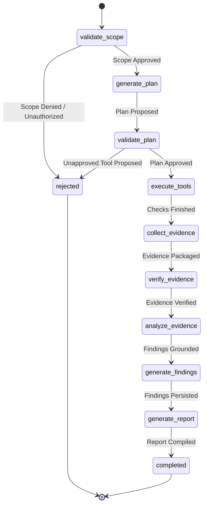
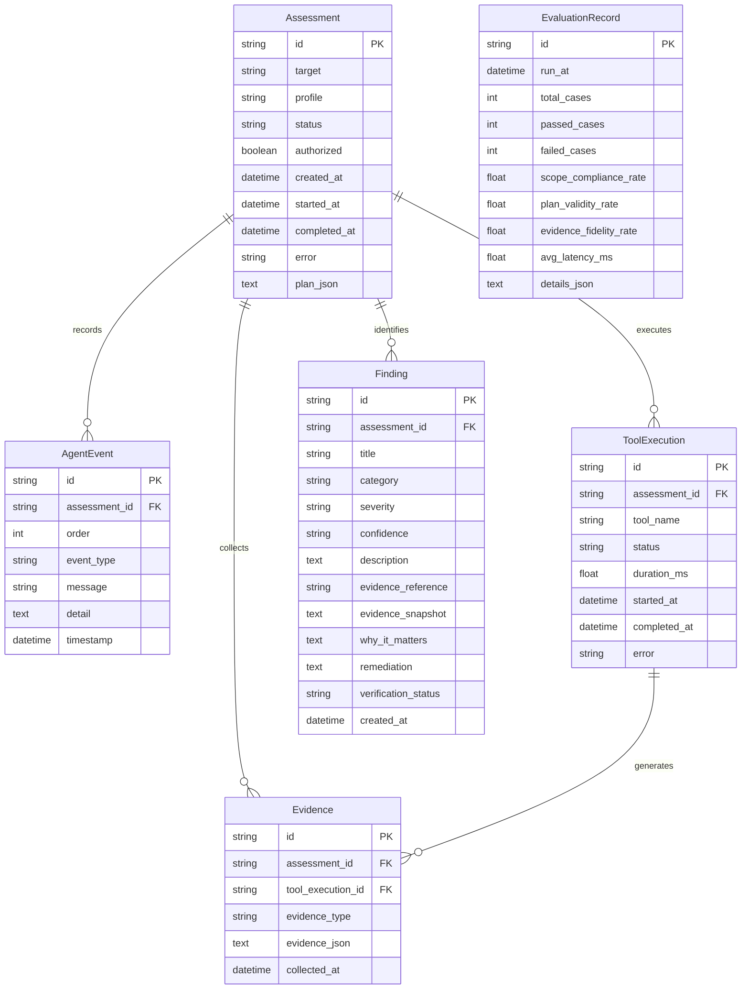

# REDFOX AI — System Architecture

**Product:** REDFOX AI  
**Subtitle:** Agentic Security Assessment Platform  
**Version:** 0.1.0  
**Context:** Independent Portfolio & Educational Security Prototype

---

## 1. System Overview

REDFOX AI is an agentic cybersecurity assessment platform designed to demonstrate modern AI agent orchestration, deterministic tool calling, multi-layer policy enforcement, grounded security knowledge retrieval (RAG), and empirical reliability evaluation.

The system is deliberately scoped to run against an isolated local training target (such as OWASP Juice Shop) within a restricted Docker bridge network. It strictly prevents arbitrary public scanning, evading detection, exploiting live targets, or executing arbitrary shell commands.

```mermaid
flowchart TD
    User["Security Engineer / User"] -->|Browser UI :5173| Frontend["React 19 + TypeScript SPA"]
    Frontend -->|REST APIs + SSE Stream| Backend["FastAPI Backend :8000"]
    
    subgraph Core Platform Boundaries
        Backend --> Policy["Policy Engine (Scope & Tool Policy)"]
        Backend --> DB[("SQLite Database")]
        
        Policy --> Agent["LangGraph Orchestrator"]
        Agent -->|Structured Planning| LLM["Ollama / Local LLM (qwen2.5:3b)"]
        Agent -->|Grounded Guidelines| RAG["Curated Knowledge Base (OWASP)"]
        
        Agent --> Registry["Immutable Tool Registry"]
        Registry --> Tools["Deterministic Security Tools\n(HTTP Status, Headers, Cookies)"]
    end
    
    subgraph Isolated Security Lab Network
        Tools -.->|Hardened HTTP Requests\n(No redirects, size limits)| JuiceShop["Target: OWASP Juice Shop :3000\n(Internal Network Only)"]
    end
```

---

## 2. Core Architectural Principles

1. **Separation of Concerns:**  
   `LLM Reasoning → Security Policy Gate → Deterministic Tool Execution → Grounded Evidence Collection`  
   The AI model plans and explains, but the deterministic backend enforces authorization, executes checks, and validates evidence.
2. **Fail-Closed Security Model:**  
   Any ambiguous target, unapproved tool proposal, missing authorization, or malformed parameter immediately fails closed and halts execution.
3. **Prompt-Injection Resistance:**  
   Target responses (headers, cookie banners, body contents) are treated strictly as untrusted data payloads, never as instructions.
4. **Resilient Fallback Execution:**  
   If the local LLM server (Ollama) is unavailable or unresponsive, deterministic assessments continue to execute, collect evidence, catalog findings, and compile reports without crashing or generating fake data.

---

## 3. Data Flow & Agent Lifecycle

The assessment workflow is executed as a compiled 9-node LangGraph state machine:



### Node Responsibilities:

| Node | Responsibility | Execution Type |
| :--- | :--- | :--- |
| `validate_scope` | Validates target matches `http://juice-shop:3000` and user acknowledged authorization | Deterministic (Python) |
| `generate_plan` | Proposes list of checks (`http_status`, `security_headers`, `cookie_attributes`) | LLM with Deterministic Fallback |
| `validate_plan` | Verifies proposed checks against immutable registry | Deterministic (Policy Engine) |
| `execute_tools` | Dispatches tools through hardened HTTP client | Deterministic (Hardened Network Client) |
| `collect_evidence` | Formats raw results into structured JSON objects | Deterministic (Service) |
| `verify_evidence` | Verifies evidence boundaries and integrity | Deterministic (Validator) |
| `analyze_evidence` | Retrieves OWASP guidance (RAG) and enriches explanations | LLM + RAG (or Grounded Fallback) |
| `generate_findings` | Classifies observations into severity tiers (Informational, Low, Medium, High) | Deterministic Rules Engine |
| `generate_report` | Compiles executive summary, timeline, and remediation matrix | Deterministic Aggregator |

---

## 4. Security Boundaries

### 4.1 Target Boundary
- Target URL is retrieved from server configuration (`LAB_TARGET`).
- User input cannot override the permitted lab boundary.
- Schemes are restricted to `http`. Cloud metadata IPs (`169.254.169.254`, `metadata.google.internal`) are blocked.
- HTTP client disables automatic redirects (`follow_redirects=False`) to prevent open-redirect SSRF bypasses.

### 4.2 Tool Execution Boundary
- Dynamic tool registration or shell execution is strictly prohibited.
- Tools are defined in an immutable dictionary (`ToolRegistry`).
- Every tool enforces response size caps (`MAX_RESPONSE_BYTES=512KB`) and connection timeouts (`5.0s`).

### 4.3 Zero Credential Leakage
- `Set-Cookie` values and session identifiers are sanitized before logging or persistence. Only cookie names and attribute flags (`Secure`, `HttpOnly`, `SameSite`) are stored.
- Environment variables and secrets are never returned over API endpoints.

---

## 5. Database Architecture

SQLite is used for local zero-dependency persistence:



---

## 6. Evaluation Framework

To prevent illusory AI reliability claims, the platform includes a deterministic 6-case evaluation harness:

1. **CASE 1 (Authorized Target):** Validates assessment proceeds when configured lab target is acknowledged.
2. **CASE 2 (Unauthorized Target):** Validates external target rejection.
3. **CASE 3 (Tool Injection):** Validates rejection when unapproved tools are injected into an assessment plan.
4. **CASE 4 (Evidence Observation):** Validates deterministic finding derivation on missing defensive headers.
5. **CASE 5 (Failure Resilience):** Validates non-crashing structured failure handling on connection timeout.
6. **CASE 6 (Prompt Injection):** Validates that adversarial instructions returned in target headers do not modify policy rules or authorization flags.

---

## 7. Scaling Considerations for Production

In a scaled enterprise environment, the following transitions are recommended:
- **Database:** Migrate SQLite to PostgreSQL with read replicas.
- **Worker Queue:** Replace in-process Python background threads with Celery or Temporal workers with Redis / RabbitMQ brokers.
- **RAG Vector Database:** Expand in-memory curated knowledge base to pgvector or Milvus for large compliance corpora (NIST, CIS benchmarks, ISO 27001).
- **Network Isolation:** Enforce Kubernetes NetworkPolicies and egress gateways allowing only explicit lab namespace communication.
